# Arc Omnichain Yield

A cross-chain yield vault that allows users to deposit USDC from multiple chains and earn yield on real-world assets (RWA) on Arc blockchain. The protocol uses Circle's Cross-Chain Transfer Protocol (CCTP) for secure USDC bridging and LiFi for token swaps, providing a seamless multi-chain deposit experience.

**Key Features:**
- 🌉 **Multi-Chain Deposits**: Deposit USDC from Sepolia, Base Sepolia, or Avalanche Fuji
- ⚡ **One-Click Zap**: Single transaction to swap any token → bridge USDC → deposit to vault
- 💰 **Yield Distribution**: 80% of yield increases share price, 20% goes to treasury
- 🔒 **Secure Bridging**: Leverages Circle's CCTP for native USDC bridging
- 📊 **Position Tracking**: Real-time vault balance, share price, and withdrawal calculations
- 🛡️ **Recovery Mechanisms**: Built-in recovery for failed transactions

## Table of Contents

- [Architecture Overview](#architecture-overview)
- [Features](#features)
- [Getting Started](#getting-started)
  - [Prerequisites](#prerequisites)
  - [Local Development Setup](#local-development-setup)
  - [Environment Variables](#environment-variables)
- [Deployment](#deployment)
  - [Deploy to Arc Testnet](#deploy-to-arc-testnet)
  - [Deploy ZapReceiver](#deploy-zapreceiver)
  - [Verification](#verification)
- [Smart Contract Reference](#smart-contract-reference)
  - [RWAVault](#rwavault)
  - [ZapReceiver](#zapreceiver)
  - [YieldToken (yRWA)](#yieldtoken-yrwa)
- [Frontend Architecture](#frontend-architecture)
  - [Key Hooks](#key-hooks)
  - [Components](#components)
  - [User Flows](#user-flows)
- [Configuration](#configuration)
  - [Circle Gateway](#circle-gateway)
  - [LiFi Integration](#lifi-integration)
  - [Admin Allowlist](#admin-allowlist)
- [Precision & Decimals](#precision--decimals)
- [Testing](#testing)
- [Troubleshooting](#troubleshooting)
- [Network Configuration](#network-configuration)
- [Contributing](#contributing)

## Architecture Overview

The Arc Omnichain Yield protocol enables users to deposit USDC from multiple chains into a single yield-bearing vault on Arc testnet.

### Multi-Chain Deposit Flow


### One-Click Zap Flow

```mermaid
sequenceDiagram
    participant User
    participant LiFi
    participant Gateway
    participant ZapReceiver
    participant Vault

    User->>LiFi: Swap token → USDC (optional)
    LiFi-->>User: USDC received
    User->>Gateway: depositForBurn(amount, Arc domain, ZapReceiver)
    Gateway-->>Gateway: Burn USDC on source chain
    Gateway-->>ZapReceiver: Mint USDC on Arc
    ZapReceiver->>ZapReceiver: processBridgedDeposit()
    ZapReceiver->>Vault: approve(USDC, amount)
    ZapReceiver->>Vault: deposit(amount)
    Vault-->>User: Mint yRWA tokens
```



### Share Price Calculation


### Yield Deposit Fee Flow


## Features

### 1. One-Click Zap
Single transaction cross-chain deposit with automatic token swapping and vault deposit.

- Swap any token to USDC using LiFi (optional)
- Bridge USDC via Circle CCTP to Arc
- Automatically deposit to vault via ZapReceiver
- Receive yRWA tokens representing vault shares

**Status flow:** `idle → swapping → bridging → awaiting_claim → claiming → completed`

### 2. 4-Step Multi-Chain Deposit
Manual multi-chain deposit flow with more control over each step.

- **Step 1:** Select chains and amounts from USDC balance scanner
- **Step 2:** Approve and deposit to Circle Gateway (supports parallel deposits from multiple chains)
- **Step 3:** Wait for bridging (automatic balance polling on Arc)
- **Step 4:** Approve and deposit to vault on Arc

### 3. Vault Dashboard
Track your vault position and manage withdrawals.

- View yRWA balance and current USDC value
- See current share price (formatted from WAD)
- Calculate maximum withdrawable amount (based on vault liquidity)
- Withdraw yRWA for USDC with liquidity checks
- Recover stuck deposits from failed transactions

### 4. Admin Panel
Treasury management and yield distribution (allowlist-gated).

- Deposit RWA yield (20% fee to treasury, 80% to vault)
- Update off-chain RWA value
- USYC treasury integration
- Combined approve + deposit for better UX

### 5. Transaction Tracking
Complete transaction history with explorer links.

- All transaction hashes stored locally
- Explorer links for all supported chains
- Transaction status verification before proceeding
- Recovery mechanisms for failed transactions

## Getting Started

### Prerequisites

- [Node.js (>= v20.18.3)](https://nodejs.org/en/download/)
- [Yarn (v1 or v2+)](https://classic.yarnpkg.com/en/docs/install/)
- [Git](https://git-scm.com/downloads)
- [Foundry](https://book.getfoundry.sh/getting-started/installation)

### Local Development Setup

1. **Clone the repository**

```bash
git clone https://github.com/yourusername/arc-omnichain-yield.git
cd arc-omnichain-yield
```

2. **Install dependencies**

```bash
yarn install
```

3. **Configure environment variables**

```bash
cp packages/nextjs/.env.example packages/nextjs/.env.local
```

Edit `.env.local` with your API keys and contract addresses (see [Environment Variables](#environment-variables) section).

4. **Start local development environment**

Open three terminals and run:

```bash
# Terminal 1 - Start local blockchain
yarn chain

# Terminal 2 - Deploy contracts
yarn deploy

# Terminal 3 - Start frontend
yarn start
```

Visit your app at: `http://localhost:3000`

### Environment Variables

Configure these variables in `packages/nextjs/.env.local`:

| Variable | Required | Description | Where to Get |
|----------|----------|-------------|--------------|
| `NEXT_PUBLIC_ALCHEMY_API_KEY` | Optional | Alchemy RPC provider | [Alchemy Dashboard](https://dashboard.alchemy.com/) |
| `NEXT_PUBLIC_WALLET_CONNECT_PROJECT_ID` | Optional | WalletConnect integration | [WalletConnect Cloud](https://cloud.walletconnect.com/) |
| **Circle Gateway** |
| `NEXT_PUBLIC_USDC_SEPOLIA` | Yes | USDC address on Sepolia | Circle USDC contract |
| `NEXT_PUBLIC_USDC_BASE_SEPOLIA` | Yes | USDC address on Base Sepolia | Circle USDC contract |
| `NEXT_PUBLIC_USDC_AVAX_FUJI` | Yes | USDC address on Avalanche Fuji | Circle USDC contract |
| `NEXT_PUBLIC_USDC_ARC_TESTNET` | Yes | USDC address on Arc Testnet | Circle USDC contract |
| `NEXT_PUBLIC_GATEWAY_WALLET` | Yes | Circle Gateway wallet address | See [gateway-config.ts](packages/nextjs/lib/gateway-config.ts) |
| `NEXT_PUBLIC_GATEWAY_MINTER` | Yes | Circle Gateway minter address | See [gateway-config.ts](packages/nextjs/lib/gateway-config.ts) |
| `NEXT_PUBLIC_GATEWAY_API_URL` | Yes | Circle API endpoint | `https://iris-api-sandbox.circle.com` |
| `NEXT_PUBLIC_DESTINATION_CHAIN_ID` | Yes | Arc testnet chain ID | `5042002` |
| **ZapReceiver** |
| `NEXT_PUBLIC_ZAP_RECEIVER_ADDRESS` | Yes | Deployed ZapReceiver contract | Deploy with script (see below) |
| **LiFi** |
| `NEXT_PUBLIC_LIFI_API_KEY` | Optional | LiFi swap routing | [LiFi Docs](https://docs.li.fi/) |
| **Admin** |
| `NEXT_PUBLIC_ADMIN_ALLOWLIST` | Optional | Comma-separated admin addresses | Your admin wallet addresses |

## Deployment

### Deploy to Arc Testnet

1. **Set up your private key**

```bash
export PRIVATE_KEY="your-private-key-here"
```

Or add to `packages/foundry/.env`:

```
PRIVATE_KEY=your-private-key-here
```

2. **Configure network in foundry.toml**

The Arc Testnet is already configured in `packages/foundry/foundry.toml`. Verify the RPC URL is correct.

3. **Deploy RWAVault**

```bash
yarn deploy --network arcTestnet
```

This deploys:
- `RWAVault.sol` - Main vault contract
- `YieldToken.sol` - yRWA share token

4. **Save deployed addresses**

After deployment, copy the contract addresses and update your `.env.local`:

```bash
NEXT_PUBLIC_VAULT_ADDRESS=0x...
NEXT_PUBLIC_YRWA_ADDRESS=0x...
```

### Deploy ZapReceiver

The ZapReceiver must be deployed separately:

```bash
yarn deploy --file DeployZapReceiver.s.sol --network arcTestnet
```

Update `.env.local` with the deployed address:

```bash
NEXT_PUBLIC_ZAP_RECEIVER_ADDRESS=0x639fdf1755ee90DF62948f554D39a9ca9074B2B2
```

### Verification

Verify your contracts on the Arc explorer:

```bash
yarn verify --network arcTestnet
```

## Smart Contract Reference

### RWAVault

Main vault contract that manages USDC deposits, yRWA minting, and yield distribution.

**Deployed Address (Arc Testnet):** `0xa8c1406ff7c71c030b418f99ef039cd746f2d439`

#### Constructor

```solidity
constructor(
    address _usdc,
    address _treasury,
    string memory _name,
    string memory _symbol
)
```

**Parameters:**
- `_usdc`: USDC token address on Arc
- `_treasury`: Treasury address for fees
- `_name`: yRWA token name (e.g., "Yield RWA Token")
- `_symbol`: yRWA token symbol (e.g., "yRWA")

#### Core Functions

##### `deposit(uint256 amount) → uint256 shares`

Deposit USDC to mint yRWA shares.

**Parameters:**
- `amount`: USDC amount (6 decimals)

**Returns:**
- `shares`: yRWA tokens minted (6 decimals)

**Requirements:**
- Caller must approve USDC to vault
- Amount must be > 0

**Events:**
- `Deposited(address indexed user, uint256 usdcAmount, uint256 shares)`

##### `withdraw(uint256 shares) → uint256 usdcAmount`

Burn yRWA shares to withdraw USDC.

**Parameters:**
- `shares`: yRWA amount to burn (6 decimals)

**Returns:**
- `usdcAmount`: USDC received (6 decimals)

**Requirements:**
- Caller must have sufficient yRWA balance
- Vault must have sufficient USDC liquidity (check `maxWithdrawable()`)

**Events:**
- `Withdrawn(address indexed user, uint256 shares, uint256 usdcAmount)`

##### `depositYield(uint256 amount)` (Owner only)

Deposit yield to vault with fee distribution.

**Parameters:**
- `amount`: USDC yield amount (6 decimals)

**Fee Structure:**
- 20% (2000 basis points) → Treasury
- 80% → Increases share price for all holders

**Requirements:**
- Only callable by owner
- Caller must approve USDC to vault

**Events:**
- `YieldDeposited(uint256 totalAmount, uint256 feeAmount, uint256 vaultAmount)`

##### `updateRWAValue(uint256 newValue)` (Owner only)

Update the off-chain RWA value claim.

**Parameters:**
- `newValue`: New claimed RWA value (6 decimals)

**Requirements:**
- Only callable by owner

**Events:**
- `RWAValueUpdated(uint256 oldValue, uint256 newValue)`

#### View Functions

##### `sharePrice() → uint256`

Current share price in WAD format (1e18 precision).

**Returns:**
- Share price: `(totalAssets * 1e18) / totalSupply`

**Note:** Use `formatSharePrice()` helper from `vault-helpers.ts` for display.

##### `totalAssets() → uint256`

Total assets under management.

**Returns:**
- `USDC balance + claimedRWAValue` (6 decimals)

##### `totalUSDC() → uint256`

Available USDC liquidity in vault.

**Returns:**
- Current USDC token balance (6 decimals)

##### `maxWithdrawable() → uint256`

Maximum USDC that can be withdrawn from vault.

**Returns:**
- `min(totalUSDC(), totalAssets)` (6 decimals)

**Note:** Withdrawals are limited by actual USDC liquidity, not claimed RWA value.

### ZapReceiver

Receives bridged USDC from Circle Gateway and automatically deposits to vault.

**Deployed Address (Arc Testnet):** Configurable via `NEXT_PUBLIC_ZAP_RECEIVER_ADDRESS`

#### Core Functions

##### `processBridgedDeposit(address recipient, uint256 amount)`

Process USDC that was bridged to this contract and deposit to vault.

**Parameters:**
- `recipient`: User address to receive yRWA tokens
- `amount`: USDC amount to deposit (6 decimals)

**Flow:**
1. Approve USDC to vault
2. Call vault.deposit(amount)
3. Transfer yRWA to recipient

**Requirements:**
- Contract must have USDC balance >= amount
- Vault must be functional

**Events:**
- `DepositProcessed(address indexed recipient, uint256 usdcAmount, uint256 shares)` on success
- `DepositFailed(address indexed recipient, uint256 usdcAmount, string reason)` on failure

##### `recoverStuckTokens(address recipient)`

Recover USDC stuck in contract from failed deposits.

**Parameters:**
- `recipient`: Address to receive recovered USDC

**Requirements:**
- Only callable by recipient
- Must have USDC balance in contract

**Events:**
- `TokensRecovered(address indexed recipient, uint256 amount)`

### YieldToken (yRWA)

ERC20 token representing vault shares.

**Properties:**
- Name: "Yield RWA Token"
- Symbol: "yRWA"
- Decimals: 6 (matches USDC)
- Mintable: Only by RWAVault
- Burnable: Only by RWAVault

## Frontend Architecture

### Key Hooks

#### `useZapDeposit()`

One-click cross-chain deposit with token swapping and automatic vault deposit.

**Location:** [packages/nextjs/hooks/useZapDeposit.ts](packages/nextjs/hooks/useZapDeposit.ts)

**Parameters:**
- `sourceChainId`: Chain ID to deposit from
- `amount`: Amount to deposit (token decimals)
- `tokenAddress`: Token to swap/deposit
- `onSuccess`: Callback function on completion

**Returns:**
```typescript
{
  executeZap: () => Promise<void>,
  status: ZapStatus, // idle | swapping | bridging | awaiting_claim | claiming | completed | error
  error: string | null,
  transactions: TransactionRecord[],
  reset: () => void
}
```

**State Flow:**
1. `idle` - Initial state
2. `swapping` - LiFi token swap in progress (if needed)
3. `bridging` - Circle Gateway deposit in progress
4. `awaiting_claim` - Waiting for USDC to arrive at ZapReceiver on Arc
5. `claiming` - Processing bridged deposit to vault
6. `completed` - Successfully minted yRWA
7. `error` - Transaction failed

**Example:**
```typescript
const { executeZap, status, error, transactions } = useZapDeposit({
  sourceChainId: 11155111, // Sepolia
  amount: "1000000", // 1 USDC (6 decimals)
  tokenAddress: "0x...", // USDC address
  onSuccess: () => console.log("Zap completed!")
});

// Execute zap
await executeZap();
```

#### `useMultiChainDeposit()`

4-step multi-chain deposit flow with manual control.

**Location:** [packages/nextjs/hooks/useMultiChainDeposit.ts](packages/nextjs/hooks/useMultiChainDeposit.ts)

**Parameters:**
- `deposits`: Array of `{ chainId, amount }`
- `onSuccess`: Callback function on completion

**Returns:**
```typescript
{
  executeDeposits: () => Promise<void>,
  txHashes: Record<number, string>, // chainId → txHash
  isLoading: boolean,
  error: string | null
}
```

**Features:**
- Parallel execution on multiple chains
- Unlimited USDC approval (only once per chain)
- Transaction hash tracking
- Explorer links for verification

**Example:**
```typescript
const { executeDeposits, txHashes, isLoading } = useMultiChainDeposit({
  deposits: [
    { chainId: 11155111, amount: "1000000" }, // 1 USDC on Sepolia
    { chainId: 84532, amount: "2000000" }     // 2 USDC on Base Sepolia
  ],
  onSuccess: () => console.log("Deposits completed!")
});

await executeDeposits();
```

#### `useVaultDeposit()`

Direct vault deposit on Arc.

**Location:** [packages/nextjs/hooks/useVaultDeposit.ts](packages/nextjs/hooks/useVaultDeposit.ts)

**Parameters:**
- `amount`: USDC amount to deposit (6 decimals)
- `onSuccess`: Callback function on completion

**Returns:**
```typescript
{
  approve: () => Promise<void>,
  deposit: () => Promise<void>,
  isApproved: boolean,
  isPending: boolean
}
```

**Example:**
```typescript
const { approve, deposit, isApproved, isPending } = useVaultDeposit({
  amount: "1000000", // 1 USDC
  onSuccess: () => console.log("Deposited!")
});

// Two-step process
await approve();
await deposit();
```

#### `useGatewayBalance()`

Poll for bridged USDC balance on Arc.

**Location:** [packages/nextjs/hooks/useGatewayBalance.ts](packages/nextjs/hooks/useGatewayBalance.ts)

**Parameters:**
- `userAddress`: Address to check balance
- `enabled`: Whether to start polling

**Returns:**
```typescript
{
  balance: bigint,
  isLoading: boolean,
  refetch: () => Promise<void>
}
```

**Features:**
- Exponential backoff polling (3s → 6s → 12s → max 30s)
- Auto-stops when balance detected
- Manual refetch capability

**Example:**
```typescript
const { balance, isLoading } = useGatewayBalance({
  userAddress: "0x...",
  enabled: true
});
```

#### `useZapRecovery()`

Recover stuck USDC from failed zap deposits.

**Location:** [packages/nextjs/hooks/useZapRecovery.ts](packages/nextjs/hooks/useZapRecovery.ts)

**Parameters:**
- `zapReceiverAddress`: ZapReceiver contract address

**Returns:**
```typescript
{
  recover: () => Promise<void>,
  canRecover: boolean,
  isPending: boolean
}
```

**Example:**
```typescript
const { recover, canRecover, isPending } = useZapRecovery({
  zapReceiverAddress: "0x639fdf1755ee90DF62948f554D39a9ca9074B2B2"
});

if (canRecover) {
  await recover();
}
```

### Components

#### Core Components

- **[OneClickZap.tsx](packages/nextjs/components/OneClickZap.tsx)** - Single transaction zap UI with LiFi integration
- **[GatewayDeposit.tsx](packages/nextjs/components/GatewayDeposit.tsx)** - 4-step multi-chain deposit flow
- **[VaultDashboard.tsx](packages/nextjs/components/VaultDashboard.tsx)** - User position tracking and withdrawals
- **[AdminPanel.tsx](packages/nextjs/components/AdminPanel.tsx)** - Treasury management (allowlist-gated)

#### Supporting Components

- **[ZapProgress.tsx](packages/nextjs/components/ZapProgress.tsx)** - Visual status indicator for zap flow
- **[TransactionList.tsx](packages/nextjs/components/TransactionList.tsx)** - Transaction history with explorer links
- **[DepositHistory.tsx](packages/nextjs/components/DepositHistory.tsx)** - Historical deposit tracking
- **[ZapHistory.tsx](packages/nextjs/components/ZapHistory.tsx)** - Zap transaction history

### User Flows

#### One-Click Zap Flow

1. User selects source chain and token
2. Optional: Swap token to USDC via LiFi
3. Approve USDC to Circle Gateway
4. depositForBurn with ZapReceiver as mintRecipient
5. Circle burns USDC on source chain
6. Circle mints USDC to ZapReceiver on Arc
7. ZapReceiver auto-deposits to vault
8. User receives yRWA tokens

#### 4-Step Deposit Flow

1. **Step 1:** Select chains and scan USDC balances
2. **Step 2:** Approve and deposit to Circle Gateway (parallel on multiple chains)
3. **Step 3:** Poll for bridged USDC balance on Arc
4. **Step 4:** Approve and deposit to vault manually

#### Withdrawal Flow

1. User views current position on VaultDashboard
2. Check max withdrawable (liquidity limit)
3. Enter withdrawal amount
4. Approve yRWA to vault
5. Call vault.withdraw(shares)
6. Receive USDC

#### Admin Yield Deposit Flow

1. Admin accesses AdminPanel (allowlist check)
2. Enter yield amount
3. View fee breakdown (20% treasury, 80% vault)
4. Combined approve + depositYield
5. Share price increases for all holders

## Configuration

### Circle Gateway

Circle's Cross-Chain Transfer Protocol (CCTP) enables native USDC transfers between chains.

**API Endpoint:** `https://iris-api-sandbox.circle.com`

**Domain IDs:**
- Sepolia: `0`
- Avalanche Fuji: `1`
- Base Sepolia: `6`
- Arc Testnet: `5`

**Configuration File:** [packages/nextjs/lib/gateway-config.ts](packages/nextjs/lib/gateway-config.ts)

**Key Functions:**
- `depositForBurn(amount, destinationDomain, mintRecipient, burnToken)` - Burn USDC and mint on destination
- Check attestation status via API
- ZapReceiver receives USDC and auto-deposits

**Resources:**
- [Circle CCTP Docs](https://developers.circle.com/stablecoins/docs/cctp-getting-started)
- [Testnet Faucet](https://faucet.circle.com/)

### LiFi Integration

LiFi provides best-route token swapping across chains.

**API Key:** Get from [LiFi Dashboard](https://docs.li.fi/)

**Configuration:**
```bash
NEXT_PUBLIC_LIFI_API_KEY=your-api-key
```

**Configuration File:** [packages/nextjs/lib/lifi-config.ts](packages/nextjs/lib/lifi-config.ts)

**Features:**
- Multi-hop swaps to USDC
- Best price routing across DEXs
- Gas estimation
- Transaction simulation

**Resources:**
- [LiFi Documentation](https://docs.li.fi/)
- [Supported Chains](https://docs.li.fi/integrate-li.fi-widget/integration-options)

### Admin Allowlist

Control access to admin panel using wallet addresses.

**Configuration:**
```bash
NEXT_PUBLIC_ADMIN_ALLOWLIST=0xAddress1,0xAddress2,0xAddress3
```

**Features:**
- Comma-separated addresses
- Case-insensitive matching
- Client-side validation
- Redirects non-admins to home page

**Admin Functions:**
- Deposit yield (20% fee)
- Update RWA value
- USYC treasury management

## Precision & Decimals

### Token Decimals

- **USDC**: 6 decimals
- **yRWA**: 6 decimals (matches USDC)
- **Share Price**: WAD format (1e18 precision)

### Why WAD Format?

The vault uses WAD (Web Assembly Decimal) format for share price to prevent rounding errors in calculations:

```solidity
sharePrice = (totalAssets * 1e18) / totalSupply
```

This gives 18 decimal precision despite yRWA having only 6 decimals.

### Helper Functions

**Location:** [packages/nextjs/utils/vault-helpers.ts](packages/nextjs/utils/vault-helpers.ts)

#### `formatSharePrice(price: bigint) → string`

Convert WAD format share price to readable format.

```typescript
const price = 1050000000000000000n; // 1.05 in WAD
formatSharePrice(price); // "1.05"
```

#### `calculateUSDCValue(shares: bigint, sharePrice: bigint) → bigint`

Calculate USDC value of yRWA shares.

```typescript
const shares = 1000000n; // 1 yRWA (6 decimals)
const price = 1050000000000000000n; // 1.05 in WAD
calculateUSDCValue(shares, price); // 1050000n (1.05 USDC)
```

#### `calculateMaxWithdrawable(shares: bigint, totalUSDC: bigint, sharePrice: bigint) → bigint`

Calculate maximum withdrawable USDC based on liquidity.

```typescript
const shares = 10000000n; // 10 yRWA
const totalUSDC = 5000000n; // 5 USDC available
const price = 1000000000000000000n; // 1.0 in WAD
calculateMaxWithdrawable(shares, totalUSDC, price); // 5000000n (limited by liquidity)
```

### Conversion Examples

```typescript
// USDC to Wei (for display)
const usdc = 1000000n; // 1 USDC (6 decimals)
const display = Number(usdc) / 1e6; // 1.0

// Wei to USDC (for transactions)
const amount = 1.5; // User input
const usdc = BigInt(Math.floor(amount * 1e6)); // 1500000n

// Share price WAD to readable
const sharePriceWAD = 1050000000000000000n;
const readable = Number(sharePriceWAD) / 1e18; // 1.05
```

## Testing

### Run Contract Tests

```bash
yarn foundry:test
```

### Test Coverage

**RWAVault Tests:** [packages/foundry/test/RWAVault.t.sol](packages/foundry/test/RWAVault.t.sol)
- ✅ Deposit USDC and mint yRWA
- ✅ Withdraw yRWA for USDC
- ✅ Deposit yield with fee distribution
- ✅ Update RWA value
- ✅ Share price calculations
- ✅ Access control (owner functions)

**ZapReceiver Tests:** [packages/foundry/test/ZapReceiver.t.sol](packages/foundry/test/ZapReceiver.t.sol)
- ✅ Process bridged USDC deposit
- ✅ Auto-deposit to vault
- ✅ Handle deposit failures
- ✅ Recover stuck tokens
- ✅ Transfer yRWA to recipient

### Manual Testing Checklist

- [ ] One-Click Zap from each chain
- [ ] Multi-chain deposit (2+ chains simultaneously)
- [ ] Gateway balance polling on Arc
- [ ] Vault deposit after bridging
- [ ] Withdrawal with liquidity limits
- [ ] Share price update after yield deposit
- [ ] Admin access control (allowlist)
- [ ] Transaction links for all chains
- [ ] Recovery from failed deposits
- [ ] LiFi token swap integration

## Troubleshooting

### "Transaction failed" after gateway deposit

**Symptoms:**
- Circle Gateway deposit succeeded
- USDC not appearing on Arc
- Zap stuck in "awaiting_claim"

**Solutions:**
1. Check Circle Gateway attestation status:
   ```
   https://iris-api-sandbox.circle.com/attestations/{txHash}
   ```
2. Verify USDC arrived at ZapReceiver on [Arc Explorer](https://testnet.arcscan.com/)
3. Click "Claim & Deposit" button manually
4. Use ZapRecovery if auto-deposit failed:
   ```typescript
   const { recover } = useZapRecovery({ zapReceiverAddress });
   await recover();
   ```

### "Insufficient liquidity" on withdrawal

**Symptoms:**
- Cannot withdraw full yRWA balance
- Max withdrawable < yRWA value

**Explanation:**
- Vault only holds USDC deposits as liquid assets
- `claimedRWAValue` is off-chain and not withdrawable
- Withdrawals limited by `totalUSDC()` in vault

**Solutions:**
1. Check `maxWithdrawable()` on dashboard
2. Wait for admin to deposit yield (increases USDC balance)
3. Withdraw in smaller amounts over time

### Share price not updating

**Symptoms:**
- Share price stuck at 1.0
- No yield being distributed

**Explanation:**
- Share price only increases when admin deposits yield
- Yield must be deposited as USDC via `depositYield()`
- Fee: 20% to treasury, 80% increases share price

**Solutions:**
1. Verify admin deposited yield recently
2. Check `YieldDeposited` events on Arc Explorer
3. Confirm treasury received 20% fee
4. Wait for transaction confirmation

### Zap stuck in "awaiting_claim"

**Symptoms:**
- Bridging completed
- USDC visible at ZapReceiver
- Auto-deposit not triggering

**Solutions:**
1. Check USDC balance at ZapReceiver address
2. Click "Claim & Deposit" button
3. Manually call `processBridgedDeposit()`:
   ```typescript
   const { recover } = useZapRecovery({ zapReceiverAddress });
   await recover();
   ```
4. Check for error events on ZapReceiver contract

### Admin panel not accessible

**Symptoms:**
- Cannot access `/admin` page
- Redirected to home page

**Solutions:**
1. Verify wallet address in `NEXT_PUBLIC_ADMIN_ALLOWLIST`
2. Check address format (checksum or lowercase)
3. Ensure wallet is connected
4. Clear browser cache and reload
5. Check browser console for errors

### LiFi swap failed

**Symptoms:**
- Swap transaction reverts
- "Swap failed" error

**Solutions:**
1. Check token approval to LiFi contract
2. Verify sufficient balance for amount + gas
3. Increase slippage tolerance
4. Try again (quotes expire after 30s)
5. Check LiFi status page for downtime

### Gateway balance not updating

**Symptoms:**
- Polling not detecting bridged USDC
- Step 3 stuck on "Waiting for bridge"

**Solutions:**
1. Wait longer (CCTP can take 5-15 minutes)
2. Check Circle Gateway API for attestation status
3. Manually refetch balance
4. Verify correct destination chain ID (5042002)
5. Check source chain explorer for burn transaction

## Network Configuration

### Supported Chains

| Network | Chain ID | Domain ID | Block Explorer |
|---------|----------|-----------|----------------|
| **Arc Testnet** | 5042002 | 5 | https://testnet.arcscan.com/ |
| Sepolia | 11155111 | 0 | https://sepolia.etherscan.io/ |
| Base Sepolia | 84532 | 6 | https://sepolia.basescan.org/ |
| Avalanche Fuji | 43113 | 1 | https://testnet.snowtrace.io/ |

### Smart Contract Addresses (Arc Testnet)

| Contract | Address |
|----------|---------|
| RWAVault | `0xa8c1406ff7c71c030b418f99ef039cd746f2d439` |
| ZapReceiver | Configurable via `NEXT_PUBLIC_ZAP_RECEIVER_ADDRESS` |
| yRWA Token | Deployed with RWAVault |
| USDC | Varies per chain (see `.env.example`) |

### RPC Configuration

RPC endpoints are configured in:
- **Frontend:** [packages/nextjs/scaffold.config.ts](packages/nextjs/scaffold.config.ts)
- **Foundry:** [packages/foundry/foundry.toml](packages/foundry/foundry.toml)

**Polling Interval:** 3000ms (suitable for L2 chains)

### Adding New Chains

1. Add network to `scaffold.config.ts`:
   ```typescript
   {
     id: 84532,
     name: "Base Sepolia",
     nativeCurrency: { name: "ETH", symbol: "ETH", decimals: 18 },
     rpcUrls: { default: { http: ["https://sepolia.base.org"] } },
     blockExplorers: { default: { name: "BaseScan", url: "https://sepolia.basescan.org" } },
   }
   ```

2. Add to Circle Gateway config (`gateway-config.ts`):
   ```typescript
   {
     chainId: 84532,
     domainId: 6,
     gatewayWallet: "0x...",
     usdcAddress: "0x...",
   }
   ```

3. Add USDC address to `.env.local`

4. Update explorer links in `TransactionList.tsx`

## Contributing

We welcome contributions to Arc Omnichain Yield!

### Development Workflow

1. Fork the repository
2. Create a feature branch: `git checkout -b feature/amazing-feature`
3. Make your changes
4. Run tests: `yarn foundry:test`
5. Commit your changes: `git commit -m 'Add amazing feature'`
6. Push to the branch: `git push origin feature/amazing-feature`
7. Open a Pull Request

### Code Style

- Follow existing code style (TypeScript, Solidity)
- Add comments for complex logic
- Update documentation for new features
- Add tests for new functionality

### Reporting Issues

Found a bug? Have a suggestion?

1. Check existing issues first
2. Create detailed issue with:
   - Description of problem
   - Steps to reproduce
   - Expected vs actual behavior
   - Screenshots if applicable
   - Environment details (chain, wallet, browser)

### Resources

- [Scaffold-ETH 2 Docs](https://docs.scaffoldeth.io)
- [Circle CCTP Docs](https://developers.circle.com/stablecoins/docs/cctp-getting-started)
- [LiFi Docs](https://docs.li.fi/)
- [Foundry Book](https://book.getfoundry.sh/)
- [Next.js Docs](https://nextjs.org/docs)

---

**Built with:** Scaffold-ETH 2, Circle CCTP, LiFi, Foundry, Next.js, RainbowKit, Wagmi, Viem

**License:** MIT
